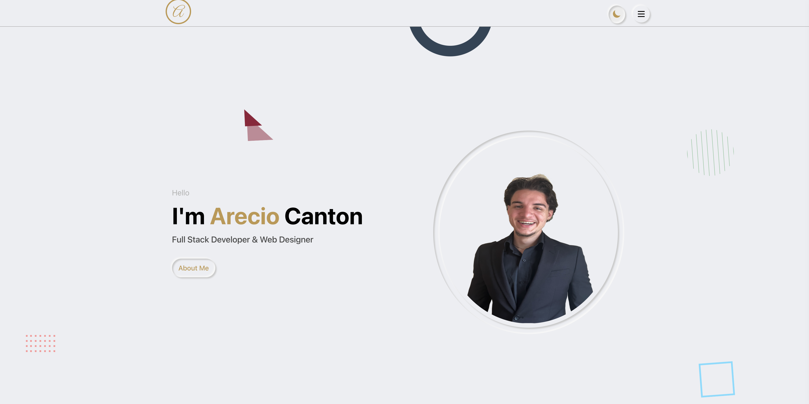
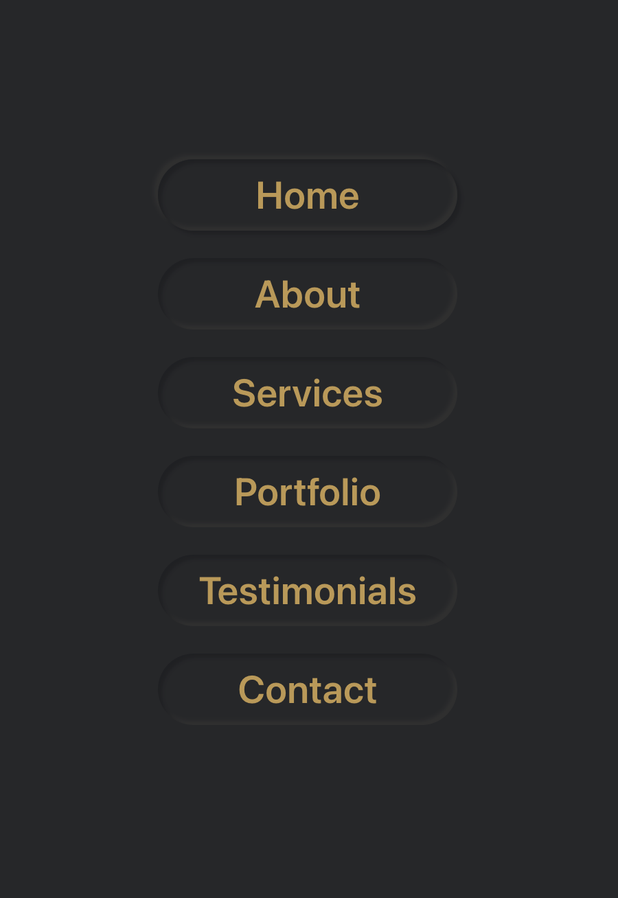
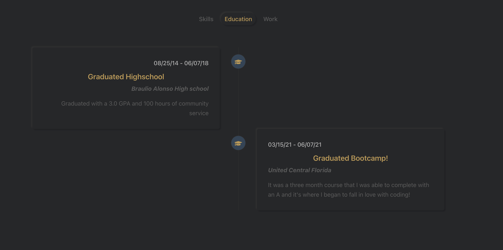
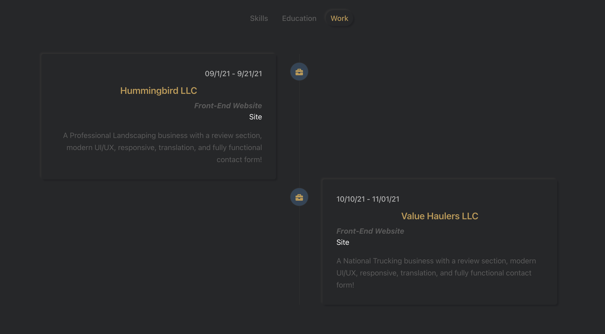
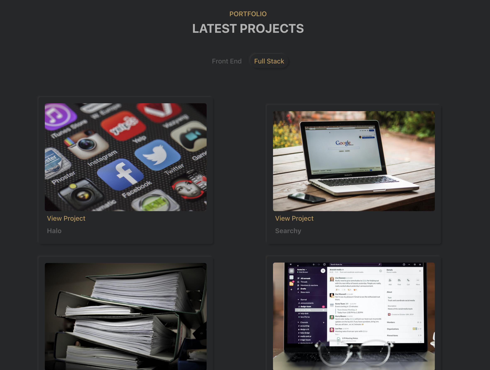
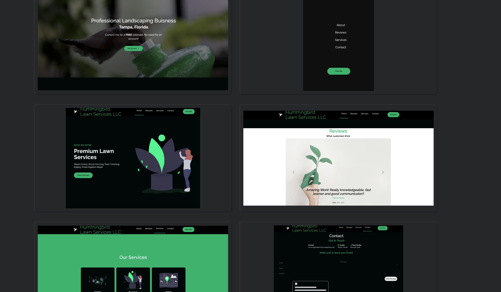

# ArecioCodes
  
  
  # Visit Site
  [areciocodes](https://areciocodes.com/)
  # Table of Contents 
  * [Installation](#Installation) 
  * [Usage](#Usage) 
  * [License](#license)
  * [Contributing](#Contribute) 
  * [Questions](#Questions)

  </img>
  </img>
  </img>
  </img>
  </img>
  </img>
  </img>
  </img>
  </img>
  </img>
  </img>
  </img>
  </img>
  </img>
  </img>
 
  # Description 
  **My latest Portfolio Website built with React JS!**
  
  # Installation
   **npm i**

  # Contribute
  **Create pull request**

  # Usage
  **git clone**

  # Questions
  If you had any questions feel free to contact my email areciocodes@gmail.com

  To see more of my work visit me here [Arecio3](https://github.com/Arecio3)

  # License
  

